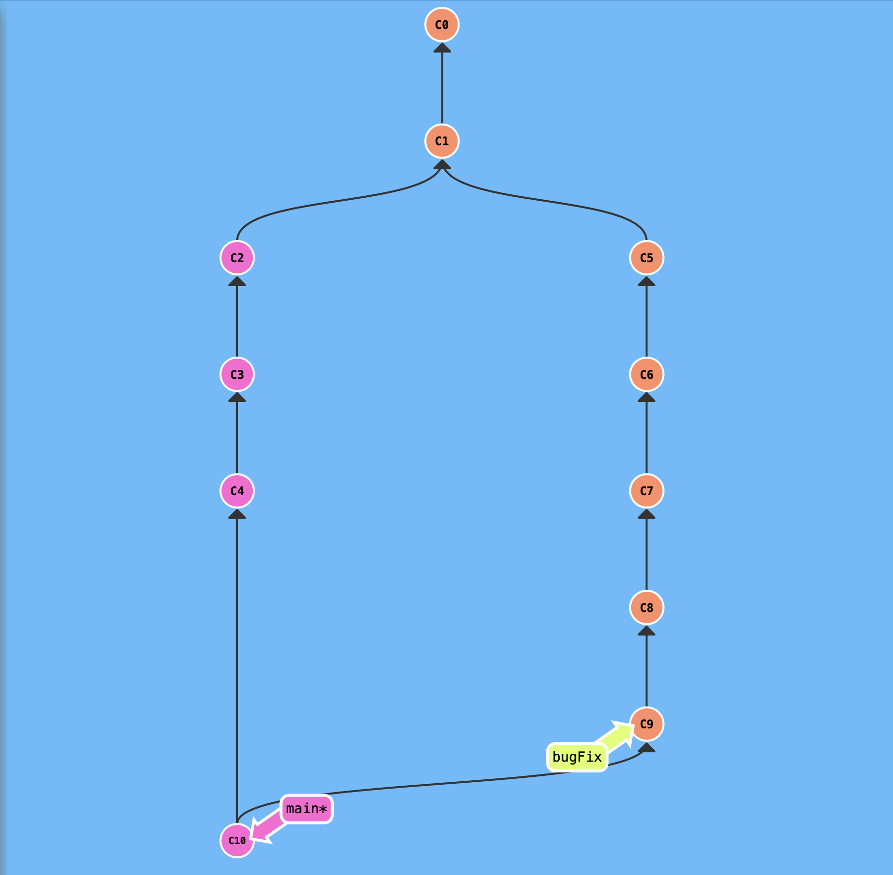
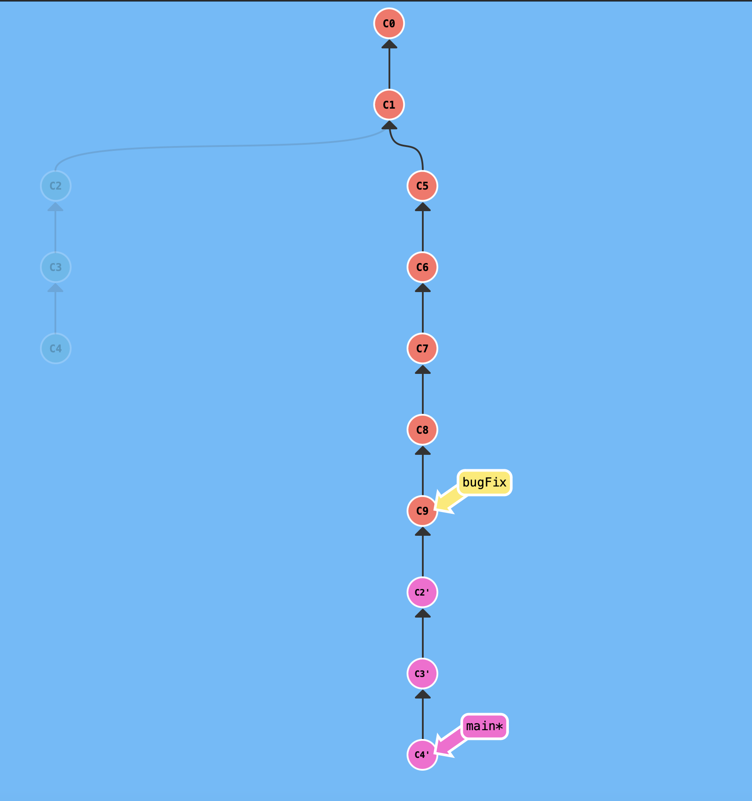

### Branching
	- create [[branch]] and checkout
		- ```shell
		  git branch [branchName]
		  git checkout [branchName]
		  
		  git checkout -b [branchName] //do both at the same time
		  ```
	- move [[branch]] pointer to a specified commit.
		-
- ### Merge vs Rebase
	- [[merge]] creates a new commit 'C10' in this case below, to combine commits from bugFix branch to main #mergevsrebase
		- ```shell
		  git merge bugFix //merge bugFix branch to main
		  ```
			- 
		- [[rebase]] copies the set of commits from the other branch to a single linear branch for a more cleaner commit history.
			- The commits in the working branch will be at the tip of the commit history after rebase. The commits in the branch that gets rebased, will be behind.
			- ```shell
			  #Rebase bugFix into main. Commits in main will stay at the tip of the history
			  git checkout main; git rebase bugFix
			  ```
				- 
			- ```shell
			  #Rebase main into bugFix. Commits in bugFix will stay at the tip of the history
			  git checkout bugFix; git rebase main
			  ```
				- {:height 674, :width 658}