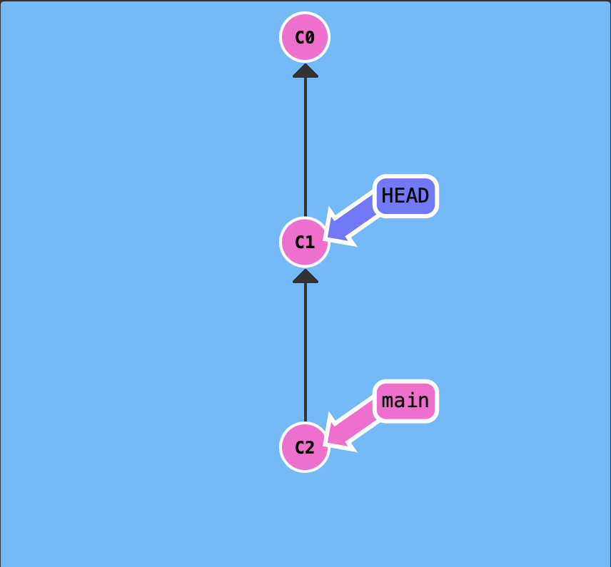
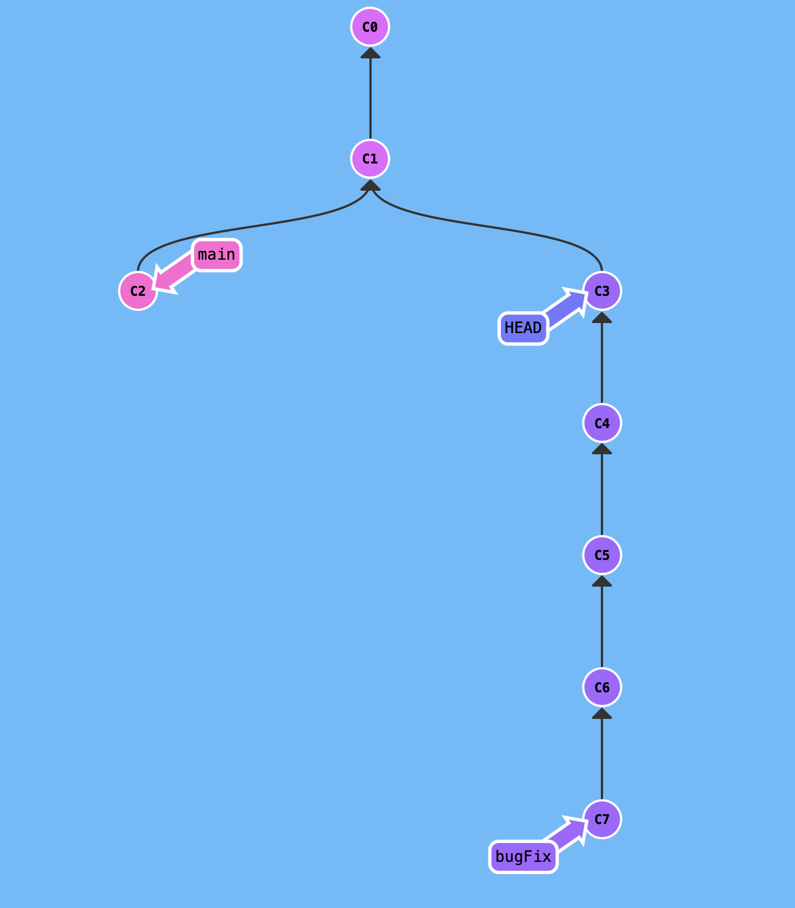
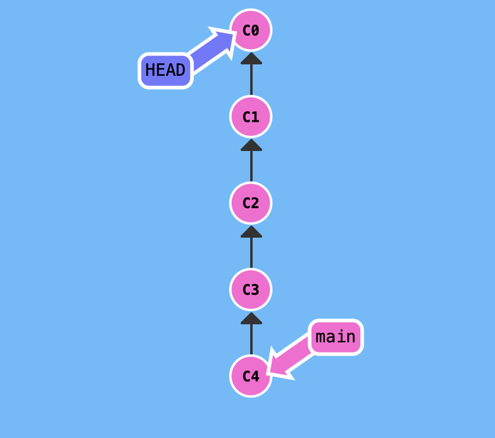

### Head
	- [[HEAD]] is the symbolic name for the currently checked out commit. It points to the working branch by default (in other words, it 'indirectly' points to the most recent commit in the working branch).
		- [[Detached Head]] means reassigning the Head from the branch reference to any other specific commit in the commit history (including the latest commit at the tip of the working branch). [detached head ref](https://git-scm.com/docs/git-checkout#_detached_head)
		-
- ### Tag
	- A git [[tag]] is a custom reference that points to a specific commit in git history. Tagging is generally used to capture a point in history that is used for a marked version release. e.g. v1.0.1
		- In simple words, a tag is like a branch that doesn't change. Meaning, it will not have no further commits.
		- Creating a tag will prevent commits that are not part of any branch (detached head) from being automatically deleted by git garbage collector.
		- Any new commit made post tag creation will be referenced by a [[detached head]].
- ### Relative References
	- #caret #tilde [[Relative References]]
		- Context: Although Git is smart about hashes as it only requires you to specify enough characters of the hash until it uniquely identifies the commit, moving around in Git by specifying commit hashes can get a bit tedious because you'll have to use `git log` to see hashes.
		- Caret Operator: Append it to a ref name to find the parent of specified commit.
			- `main^` is equivalent to "the first parent of `main`"
				- ```shell
				  #creates a detached head pointing to the parent of last commit in main
				  git checkout main^
				  ```
				- 
			- `main^^` is the grandparent (second-generation ancestor) of `main`
				- ```shell
				  #creates a detached head pointing to the 4th previous commit in the history from the tip.
				  git checkout bugFix^^^^
				  ```
				- 
		- Tilde Operator: Say you want to move a lot of levels up in the commit tree. It might be tedious to type `^`several times, so Git also has the tilde (~) operator. It (optionally) takes in a trailing number that specifies the number of parents you would like to ascend.
			- `HEAD~4` is equivalent to 4th previous commit from the current commit.
				- ```shell
				  #Check out 4th commit up the commit history.
				  git checkout HEAD~4
				  ```
				- 